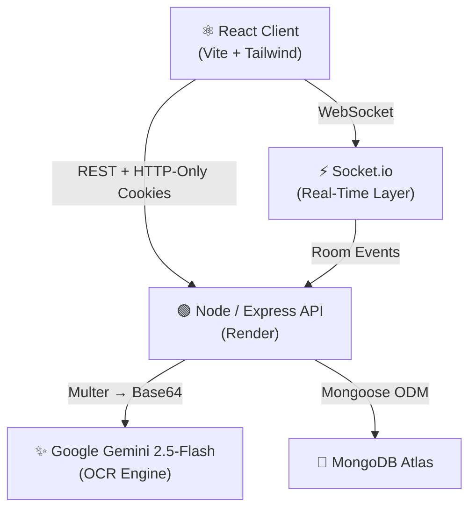

# SplitSmart

> An AI-powered, real-time group expense splitting application built on the MERN stack.

SplitSmart eliminates the complexity of shared expenses — whether it's a group dinner, a trip, or shared living costs. It combines AI receipt scanning, live cooperative item claiming, and an optimized debt settlement engine to make splitting fair, fast, and frictionless.

---

## Architecture



**Request lifecycle:**
1. The React client communicates with the Express API over REST (with JWT stored in HTTP-only refresh cookies).
2. Real-time item claims and group chat are relayed via a persistent Socket.io connection.
3. Receipt images are streamed in-memory through Multer directly to Gemini — no files ever touch disk.
4. All persistent state (users, groups, expenses, settlements, messages) lives in MongoDB Atlas.

---

## Key Features

- **Frictionless Guest Onboarding** — Group members join instantly via invite link with only a display name; no account required. Guests can upgrade to a full account at any time without losing their history.
- **AI Receipt Parsing** — Upload a photo of any receipt and Gemini 2.5-Flash extracts itemised line items into clean JSON, correctly parsing bulk rows and normalising tax entries.
- **Real-Time Cooperative Claims** — Each person taps the items they consumed on their own device. Claims sync live across all connected group members via Socket.io.
- **Concurrency-Safe Item Claiming** — Optimistic Concurrency Control (OCC) with jitter-based retry backoff prevents race conditions when multiple users claim items simultaneously.
- **Greedy Minimum Cash Flow Solver** — A 3-phase debt simplification engine consolidates redundant peer transfers (e.g. A→B→C becomes A→C directly), minimising the total number of transactions required to settle a group.
- **Sliding-Window Token Refresh** — Axios interceptors silently obtain fresh access tokens on 401 responses, keeping sessions alive without re-authentication prompts.

---

## Tech Stack

### Backend
| Layer | Technology |
|---|---|
| Runtime | Node.js (v18+) |
| Framework | Express.js |
| Database | MongoDB + Mongoose ODM |
| Real-Time | Socket.io |
| Auth | JWT (Access + HTTP-Only Refresh) · bcryptjs |
| AI / Image | Google Generative AI SDK · Multer (memory storage) |
| Utilities | Morgan · dotenv · cors · express-rate-limit |

### Frontend
| Layer | Technology |
|---|---|
| Framework | React (Vite) |
| Styling | Tailwind CSS |
| State | React Context API (Auth + Socket contexts) |
| HTTP | Axios with refresh interceptors |
| Real-Time | Socket.io-client |
| Routing | React Router v6 |
| Notifications | react-hot-toast |

---

## Getting Started

### Prerequisites

Ensure the following are installed on your machine before proceeding:

- [Node.js](https://nodejs.org/) v18.x or higher
- [Git](https://git-scm.com/)
- A MongoDB instance — local or a free [MongoDB Atlas](https://www.mongodb.com/atlas) M0 cluster
- A [Google Gemini API Key](https://aistudio.google.com/) for receipt parsing

---

### 1. Clone the Repository

```bash
git clone https://github.com/Miso-sou/splitSmart.git
cd splitSmart
```

---

### 2. Configure Environment Variables

#### Backend — `backend/.env`

```bash
# Navigate to the backend directory and create the env file
cd backend
touch .env          # macOS / Linux
# New-Item .env     # PowerShell
# copy nul .env     # Windows CMD
```

Populate `backend/.env` with the following:

```env
PORT=5000
MONGO_URI=mongodb+srv://<db_user>:<password>@cluster.xxxx.mongodb.net/splitsmart?retryWrites=true&w=majority
JWT_SECRET=<strong_random_string_for_access_tokens>
JWT_REFRESH_SECRET=<separate_strong_random_string_for_refresh_tokens>
GEMINI_API_KEY=AIzaSy...YourGeminiKeyHere
CLIENT_URL=http://localhost:5173
NODE_ENV=development
```

#### Frontend — `frontend/.env`

```bash
cd ../frontend
touch .env
```

```env
VITE_API_URL=http://localhost:5000
```

---

### 3. Install Dependencies

```bash
# Backend
cd backend && npm install

# Frontend
cd ../frontend && npm install
```

---

### 4. Run Locally

Open two terminal windows:

```bash
# Terminal 1 — Backend (http://localhost:5000)
cd backend && npm run dev

# Terminal 2 — Frontend (http://localhost:5173)
cd frontend && npm run dev
```

Navigate to `http://localhost:5173` to use the application.

---

### 5. Build for Production

```bash
# Frontend — outputs optimised bundle to frontend/dist/
cd frontend && npm run build

# Backend — start the Node process
cd backend && npm start
```

> **Note:** Set `NODE_ENV=production` in your hosting environment (e.g. Render dashboard) to activate secure HTTP-only cookie protocols.

---

## License

This project is open-source. See [LICENSE](LICENSE) for details.
